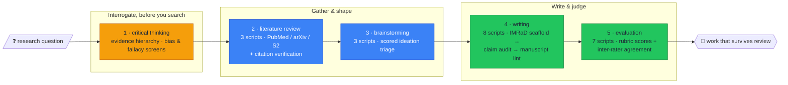

# Research Hound: a scientific research workflow for Claude Code

[](https://github.com/AlveeeRahman/research-hound/actions/workflows/ci.yml)
[](https://github.com/AlveeeRahman/research-hound/blob/main/LICENSE)
[](https://www.python.org/downloads/)

**Documentation**: [alveeerahman.github.io/research-hound](https://alveeerahman.github.io/research-hound/) ·
part of a three-skill suite with [Skill Vision](https://alveeerahman.github.io/skill-vision/)
and [Agent Oracle](https://alveeerahman.github.io/agent-oracle/).

**research-hound** is an [Agent Skill](https://code.claude.com/docs/en/skills) for Claude
Code that turns Claude into a methodical research partner: a five-stage scientific
workflow (critical thinking, literature review, brainstorming, writing, evaluation)
backed by **21 runnable scripts** that verify what a chat model would
otherwise just assert. It hunts down the weak citation, the untraceable claim, and the
statistical pitfall before a reviewer does.

## Get it on the scent

```bash
# All your projects (personal skill):
git clone https://github.com/AlveeeRahman/research-hound.git ~/.claude/skills/research-hound

# Or one project only (shareable with your team through git):
git clone https://github.com/AlveeeRahman/research-hound.git .claude/skills/research-hound
```

Python 3.10+, standard library only, except `requests` in the one script that reaches
the network: `scripts/literature-review/verify_citations.py`, which queries DOI resolvers
to check a reference actually resolves. No script needs an API key, and nothing sends your
prose, data or figures to a hosted model.
Then ask Claude in your own words:

> *"Search the literature on X and verify every citation."*
> *"Audit the claims in my methods section against my sources."*
> *"Is this analysis p-hacked?"*
> *"Score this manuscript against the rubric and report inter-rater agreement."*

## The hound's route: five stages, twenty-one checks

A research question goes in one end. A manuscript that can survive review comes out the
other. No stage is skippable, and every stage past the first carries its own runnable
tooling:



| # | Stage | Scripts | What actually runs |
|--:|---|--:|---|
| 1 | Critical thinking | none | Evidence hierarchy, logical fallacies, statistical pitfalls, bias catalogs (`references/critical-thinking/`) |
| 2 | Literature review | 3 | `search_databases.py` (dedupes, ranks and formats results Claude retrieves from PubMed / arXiv / Semantic Scholar — it opens no connection of its own), `verify_citations.py` (queries DOI resolvers), `generate_pdf.py` |
| 3 | Brainstorming | 3 | Scored ideation matrix, session scaffolds, register validation |
| 4 | Writing | 8 | `scaffold_manuscript.py` (IMRaD), `lint_manuscript.py`, `audit_claims.py`, `check_references.py`, `check_consistency.py`, `select_reporting_guidelines.py` (CONSORT / PRISMA / STROBE), `validate_authorship.py` |
| 5 | Evaluation | 7 | `validate_rubric.py`, `calculate_scores.py`, `summarize_agreement.py` (inter-rater), `weight_sensitivity.py`, `check_traceability.py` |

## How research-hound differs: the validation

### vs. Claude's built-in research

Claude's native web search and Deep Research are **retrieval and synthesis**: they find
sources and write summaries, in one pass, inside the chat. research-hound is a
**methodology harness** on top of the model:

- **Verification, not just citation.** `verify_citations.py` checks that references
  actually resolve and `audit_claims.py` traces each manuscript claim to its evidence.
  Those are the two failure modes chat-only research cannot catch in itself.
- **Staged discipline.** Question interrogation before searching, searching before
  synthesis, a source ledger throughout, and rubric scoring with inter-rater agreement at
  the end. Built-in research has no stages to hold it accountable.
- **Deterministic and reproducible.** Every check is a plain CLI your CI can re-run.
  A conversation cannot be re-run. `pytest`-style verification can.
- **Scientific-writing integrity rules.** Formatting guidance keeps equations, symbols,
  units, subscripts, and superscripts intact through drafting and format conversion, and
  the skill deliberately ships *no* boilerplate LaTeX template. Templates that fabricate
  polish were removed in favor of integrity rules (see
  `references/writing/professional_report_formatting.md`).
- **Research-integrity guardrails.** Authorship and AI-confidentiality policy,
  responsible-AI brainstorming constraints, and reporting-guideline selection
  (CONSORT / PRISMA / STROBE) are first-class steps, not afterthoughts.

### vs. the top research skills on GitHub

Surveyed August 2026 against the most-starred repos in the class (this niche's leaders
sit at 1-2 stars, so the field is young):

| | research-hound | `rongarede/claude-skills-research` | `chgagne/claude-skills-research` | `jamoeight/deep-research-v2` |
|---|:---:|:---:|:---:|:---:|
| Shape | one staged workflow, question → publication | 8 independent point skills | review-support skills (ML/CS + HPC) | multi-agent deep-research harness |
| End-to-end lifecycle (think → search → write → judge) | ✅ 5 stages | ❌ | ❌ review-centric | ❌ report-centric (6 phases of *search*) |
| Runnable verification scripts | ✅ 21 | partial (paper lookup/download) | ✅ (bibliography checks, guard-tested stdlib) | ❌ orchestration, not local CLIs |
| Citation verification | ✅ `verify_citations.py` | via Semantic Scholar skill | ✅ | ❌ |
| Manuscript pipeline (IMRaD scaffold → claim audit → lint → reporting guidelines) | ✅ | ❌ | ❌ | ❌ |
| Rubric evaluation with inter-rater agreement | ✅ | ❌ | ❌ | evaluator-driven search only |
| Externally QA-audited + CI-validated | ✅ skill-vision, every push | ❌ | ❌ | ❌ |

Honest credit where due: `chgagne`'s bibliography tooling is real and its
stdlib-guard-test discipline is excellent, and `jamoeight/deep-research-v2` is the strongest
*search orchestration* in the class. Neither covers the lifecycle. What happens before
the search (interrogating the question) and after it (writing, auditing, and scoring the
result) is where research-hound lives. Where a lighter skill fits better, say a one-shot
digest or a single-domain screen, use the lighter skill. This one is for work that has to
survive review.

## claude.ai / Desktop upload caveat

The frontmatter description is ~600 characters, tuned for Claude Code triggering. The
claude.ai web uploader caps descriptions at **200 characters**, so shorten it in your zip
copy before uploading, and exclude `.git`:

```bash
zip -r research-hound.zip research-hound -x "research-hound/.git/*" "research-hound/.git"
```

## What's new in v1.2.0

**The description now fits claude.ai's uploader.** It caps `description` at 200 characters; the Agent Skills spec allows 1024, so a 652-character description passed every local check and would still have been rejected on upload. It is 192 characters now, rewritten rather than truncated — a plain cut would have removed the whole "Use for…" clause, which is the half that decides when the skill triggers. The `compatibility` field was also unquoted while containing `: `, which made the frontmatter fail a strict YAML parse.

**The image-generation stage is gone.** It posted your diagram prompt to a hosted model
and needed an API key, and its documentation had described one of its two scripts as an
offline alternative when it was a thin wrapper around the online one. Rather than
document that more loudly, the whole stage was removed: a research skill that uploads
descriptions of unpublished work is the wrong default however clearly the upload is
disclosed.

One script now reaches the network — `verify_citations.py`, checking that a DOI
resolves — and no script needs an API key. Write diagrams as Mermaid inline; Claude Code
and claude.ai both render it, which covers flowcharts, CONSORT and PRISMA diagrams,
pathways and most mechanism figures.

**Every reference file is now one link hop from SKILL.md.** All 36 sat two hops out, behind
a guide. Anthropic's authoring guidance names that as an anti-pattern, because past one hop
an agent tends to preview a file with `head -100` rather than read it, so the end is never
seen. The guides still carry each stage's workflow. A compact index in SKILL.md links every
reference directly, so either route works.

**Tables of contents on all 30 reference files over 100 lines.** A partial read now still
shows the full scope of what is in the file.

**Documented commands now run from where the docs say to run them.** Several reference
files invoked bare filenames like `python search_databases.py` for scripts that live under
`scripts/literature-review/`. An agent following those literally fails. A stale block of
upstream CI calling `skills-ref`, `skill-scanner` and `scan_pr_skills.py`, none of which
ship here, is now labelled as the upstream project's pipeline instead of reading as
instructions.

**Licensing.** The guides and references derive from K-Dense AI's MIT-licensed
`scientific-agent-skills`, and MIT requires the original notice travel with them. LICENSE
carried only one copyright line. It now retains both.

**Description trimmed from 932 characters to roughly 600.** That text loads into the system
prompt of every session whether or not the skill ever triggers, which makes it the one cost
paid unconditionally. It went from 233 tokens to 168.

CI now audits documentation claims against the code on every push, and sweeps every CLI for
a working `--help`.

## What's in the box

- **`SKILL.md`**: the five-stage routing instructions Claude loads (~3.6k tokens total context cost).
- **`guides/`**: one guide per stage.
- **`references/`**: 36 stage-organized reference documents (evidence hierarchies, database strategies, citation styles, IMRaD structure, evaluation frameworks…), each linked directly from SKILL.md.
- **`scripts/`**: 21 CLIs across four stages (critical thinking ships no scripts, by design).
- **`scripts/_shared/safe_io.py`**: the file-I/O module shared by the brainstorming, evaluation, and writing stages. It opens local files with `O_NOFOLLOW` and checks the resulting descriptor via `os.fstat`, so a symlink swapped in between a check and a read cannot be followed. Each stage keeps its own extra checks on top: duplicate-key rejection, non-finite-number rejection, structure and depth bounds, and, for evaluation, rejection of private-field keys.
- **`assets/`**: supporting fixtures.

## License

[MIT](https://github.com/AlveeeRahman/research-hound/blob/main/LICENSE), copyright (c) 2026 MrPirate.

Composed from five skills in [K-Dense AI's `scientific-agent-skills`](https://github.com/K-Dense-AI/scientific-agent-skills) (MIT):
`scientific-critical-thinking`, `literature-review`, `scientific-brainstorming`,
`scientific-writing`, and `scholar-evaluation`. The guide and
reference bodies are derived from those originals and carry their upstream copyright,
retained in [LICENSE](LICENSE) and detailed in [NOTICE](NOTICE) as MIT requires.

*May your citations always resolve on the first fetch.*
