# Research Hound — the extended research skill for Claude

[](https://github.com/AlveeeRahman/research-hound/actions/workflows/ci.yml)
[](https://github.com/AlveeeRahman/research-hound/blob/main/LICENSE)
[](https://www.python.org/downloads/)

**research-hound** is an [Agent Skill](https://code.claude.com/docs/en/skills) for Claude
Code that turns Claude into a methodical research partner: a six-stage scientific
workflow — critical thinking, literature review, brainstorming, schematics, writing,
evaluation — backed by **26 runnable scripts** that verify what a chat model would
otherwise just assert. It hunts down the weak citation, the untraceable claim, and the
statistical pitfall before a reviewer does.

## Get it on the scent

```bash
# All your projects (personal skill):
git clone https://github.com/AlveeeRahman/research-hound.git ~/.claude/skills/research-hound

# Or one project only (shareable with your team through git):
git clone https://github.com/AlveeeRahman/research-hound.git .claude/skills/research-hound
```

Python 3.9+; standard library only, except `requests` in the two network scripts
(citation verification and AI schematic generation). Then ask Claude in your own words:

> *"Search the literature on X and verify every citation."*
> *"Audit the claims in my methods section against my sources."*
> *"Is this analysis p-hacked?"*
> *"Score this manuscript against the rubric and report inter-rater agreement."*

```

In skill-vision's field audit of a 20-skill corpus, this skill took the **top quality
score of the entire corpus**. CI re-runs the same spec validation on every push.

## The hound's route: six stages, twenty-six checks

A research question goes in one end; a manuscript that can survive review comes out the
other. No stage is skippable, and every stage past the first carries its own runnable
tooling:

```mermaid
flowchart LR
    q[/"❓ research question"/] --> ct
    subgraph THINK["Interrogate — before you search"]
        ct["1 · critical thinking<br/>evidence hierarchy · bias & fallacy screens"]
    end
    subgraph GATHER["Gather & shape"]
        direction LR
        lr["2 · literature review<br/>3 scripts · PubMed / arXiv / S2<br/>+ citation verification"] --> bs["3 · brainstorming<br/>4 scripts · scored ideation triage"]
        bs --> sc["4 · schematics<br/>2 scripts · figures & diagrams"]
    end
    subgraph SHIP["Write & judge"]
        direction LR
        wr["5 · writing<br/>9 scripts · IMRaD scaffold →<br/>claim audit → manuscript lint"] --> ev["6 · evaluation<br/>8 scripts · rubric scores +<br/>inter-rater agreement"]
    end
    ct --> lr
    sc --> wr
    ev --> out{{"📄 work that survives review"}}
    classDef think fill:#f59e0b,stroke:#b45309,color:#1f2937
    classDef gather fill:#3b82f6,stroke:#1d4ed8,color:#ffffff
    classDef ship fill:#22c55e,stroke:#15803d,color:#1f2937
    class ct think
    class lr,bs,sc gather
    class wr,ev ship
```



| # | Stage | Scripts | What actually runs |
|--:|---|--:|---|
| 1 | Critical thinking | — | Evidence hierarchy, logical fallacies, statistical pitfalls, bias catalogs (`references/critical-thinking/`) |
| 2 | Literature review | 3 | `search_databases.py` (PubMed / arXiv / Semantic Scholar), `verify_citations.py`, `generate_pdf.py` |
| 3 | Brainstorming | 4 | Scored ideation matrix, session scaffolds, register validation |
| 4 | Schematics | 2 | Diagram generation with iterative refinement |
| 5 | Writing | 9 | `scaffold_manuscript.py` (IMRaD), `lint_manuscript.py`, `audit_claims.py`, `check_references.py`, `check_consistency.py`, `select_reporting_guidelines.py` (CONSORT / PRISMA / STROBE), `validate_authorship.py` |
| 6 | Evaluation | 8 | `validate_rubric.py`, `calculate_scores.py`, `summarize_agreement.py` (inter-rater), `weight_sensitivity.py`, `check_traceability.py` |

## How research-hound differs — the validation

### vs. Claude's built-in research

Claude's native web search and Deep Research are **retrieval and synthesis**: they find
sources and write summaries, in one pass, inside the chat. research-hound is a
**methodology harness** on top of the model:

- **Verification, not just citation.** `verify_citations.py` checks that references
  actually resolve and `audit_claims.py` traces each manuscript claim to its evidence —
  the two failure modes chat-only research cannot catch in itself.
- **Staged discipline.** Question interrogation before searching; searching before
  synthesis; a source ledger throughout; rubric scoring with inter-rater agreement at the
  end. Built-in research has no stages to hold it accountable.
- **Deterministic and reproducible.** Every check is a plain CLI your CI can re-run.
  A conversation cannot be re-run; `pytest`-style verification can.
- **Scientific-writing integrity rules.** Formatting guidance keeps equations, symbols,
  units, subscripts, and superscripts intact through drafting and format conversion, and
  the skill deliberately ships *no* boilerplate LaTeX template — templates that fabricate
  polish were removed in favor of integrity rules (see
  `references/writing/professional_report_formatting.md`).
- **Research-integrity guardrails.** Authorship and AI-confidentiality policy,
  responsible-AI brainstorming constraints, and reporting-guideline selection
  (CONSORT / PRISMA / STROBE) are first-class steps, not afterthoughts.

### vs. the top research skills on GitHub

Surveyed August 2026 against the most-starred repos in the class (this niche's leaders
sit at 1–2 stars — the field is young):

| | research-hound | `rongarede/claude-skills-research` | `chgagne/claude-skills-research` | `jamoeight/deep-research-v2` |
|---|:---:|:---:|:---:|:---:|
| Shape | one staged workflow, question → publication | 8 independent point skills | review-support skills (ML/CS + HPC) | multi-agent deep-research harness |
| End-to-end lifecycle (think → search → write → judge) | ✅ 6 stages | ❌ | ❌ review-centric | ❌ report-centric (6 phases of *search*) |
| Runnable verification scripts | ✅ 26 | partial (paper lookup/download) | ✅ (bibliography checks, guard-tested stdlib) | ❌ orchestration, not local CLIs |
| Citation verification | ✅ `verify_citations.py` | via Semantic Scholar skill | ✅ | ❌ |
| Manuscript pipeline (IMRaD scaffold → claim audit → lint → reporting guidelines) | ✅ | ❌ | ❌ | ❌ |
| Rubric evaluation with inter-rater agreement | ✅ | ❌ | ❌ | evaluator-driven search only |
| Externally QA-audited + CI-validated | ✅ skill-vision, every push | ❌ | ❌ | ❌ |

Honest credit where due: `chgagne`'s bibliography tooling is real and its
stdlib-guard-test discipline is excellent; `jamoeight/deep-research-v2` is the strongest
*search orchestration* in the class. Neither covers the lifecycle — what happens before
the search (interrogating the question) and after it (writing, auditing, and scoring the
result) is where research-hound lives. Where a lighter skill fits better — a one-shot
digest, a single-domain screen — use the lighter skill; this one is for work that has to
survive review.

## claude.ai / Desktop upload caveat

The frontmatter description is ~930 characters, tuned for Claude Code triggering. The
claude.ai web uploader caps descriptions at **200 characters** — shorten it in your zip
copy before uploading, and exclude `.git`:

```bash
zip -r research-hound.zip research-hound -x "research-hound/.git/*" "research-hound/.git"
```

## What's in the box

- **`SKILL.md`** — the six-stage routing instructions Claude loads (~2.7k tokens total context cost).
- **`guides/`** — one guide per stage.
- **`references/`** — 40+ stage-organized reference documents (evidence hierarchies, database strategies, citation styles, IMRaD structure, evaluation frameworks…).
- **`scripts/`** — 26 CLIs across five stages.
- **`assets/`** — supporting fixtures.

## License

[MIT](https://github.com/AlveeeRahman/research-hound/blob/main/LICENSE) — copyright (c) 2026 MrPirate.

*May your citations always resolve on the first fetch.*
